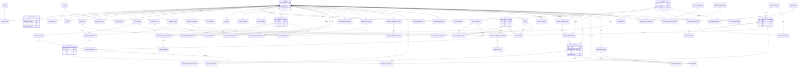

# FitFlow Suite ER Diagram

```mermaid
erDiagram
    USERS ||--o{ USER_ROLES : has
    ROLES ||--o{ USER_ROLES : assigns
    USERS ||--|| USER_PROFILES : owns
    USERS ||--o{ USER_DEVICES : uses
    USERS ||--o{ GOALS : sets
    USERS ||--o{ FOOD_LOGS : logs
    USERS ||--o{ HYDRATION_LOGS : logs
    USERS ||--o{ MEAL_PLANS : receives
    USERS ||--o{ SHOPPING_LISTS : owns
    USERS ||--o{ TRAINING_PLANS : follows
    USERS ||--o{ WORKOUT_SESSIONS : performs
    USERS ||--o{ BODY_METRICS : records
    USERS ||--o{ USER_BADGES : earns
    USERS ||--o{ STREAKS : maintains
    USERS ||--o{ GYM_MEMBERSHIPS : holds
    USERS ||--o{ GYM_CHECKINS : performs
    USERS ||--|| COACH_PROFILES : may_be
    USERS ||--o{ COACH_CLIENTS : coaches
    USERS ||--o{ COACH_CLIENTS : trains
    USERS ||--o{ MEDIA_ASSETS : uploads
    USERS ||--o{ EXERCISE_FORM_SUBMISSIONS : submits
    USERS ||--o{ BODY_PROGRESS_ENTRIES : logs
    USERS ||--o{ MEAL_PHOTO_ENTRIES : logs
    USERS ||--o{ AI_EQUIPMENT_REQUESTS : receives
    USERS ||--|| HOME_GYM_PROFILES : owns
    USERS ||--o{ TRAINING_CALENDAR_CYCLES : plans
    USERS ||--o{ CALENDAR_WORKOUT_EVENTS : schedules
    USERS ||--|| TRAINER_DASHBOARDS : operates
    USERS ||--o{ BILLING_ACCOUNTS : owns
    USERS ||--o{ TRAINER_SERVICE_PLANS : offers
    USERS ||--o{ CLIENT_SUBSCRIPTIONS : manages
    USERS ||--o{ INVOICES : issues
    USERS ||--o{ PAYMENTS : pays_or_receives
    USERS ||--o{ PAYMENT_METHODS : stores

    HEALTH_CONDITIONS ||--o{ USER_HEALTH_CONDITIONS : maps
    USERS ||--o{ USER_HEALTH_CONDITIONS : has
    DIETARY_PREFERENCES ||--o{ USER_DIETARY_PREFERENCES : maps
    USERS ||--o{ USER_DIETARY_PREFERENCES : has

    MEAL_TEMPLATES ||--o{ MEAL_TEMPLATE_ITEMS : contains
    FOODS ||--o{ MEAL_TEMPLATE_ITEMS : references
    FOOD_LOGS ||--o{ FOOD_LOG_ITEMS : contains
    FOODS ||--o{ FOOD_LOG_ITEMS : references

    MEAL_PLANS ||--o{ MEAL_PLAN_DAYS : contains
    MEAL_PLAN_DAYS ||--o{ MEAL_PLAN_ENTRIES : contains
    MEAL_TEMPLATES ||--o{ MEAL_PLAN_ENTRIES : references

    STORES ||--o{ STORE_ITEMS : stocks
    FOODS ||--o{ STORE_ITEMS : sold_as
    SHOPPING_LISTS ||--o{ SHOPPING_LIST_ITEMS : contains
    FOODS ||--o{ SHOPPING_LIST_ITEMS : references
    STORES ||--o{ SHOPPING_LIST_ITEMS : best_store

    MUSCLE_GROUPS ||--o{ EXERCISES : primary_group
    EXERCISES ||--o{ EXERCISE_MEDIA : shows
    EXERCISES ||--o{ EXERCISE_MUSCLES : targets
    MUSCLE_GROUPS ||--o{ EXERCISE_MUSCLES : linked

    TRAINING_PLANS ||--o{ TRAINING_PLAN_WEEKS : organizes
    TRAINING_PLAN_WEEKS ||--o{ WORKOUTS : contains
    WORKOUTS ||--o{ WORKOUT_EXERCISES : includes
    EXERCISES ||--o{ WORKOUT_EXERCISES : selected

    WORKOUT_SESSIONS ||--o{ WORKOUT_SESSION_EXERCISES : contains
    EXERCISES ||--o{ WORKOUT_SESSION_EXERCISES : performed
    WORKOUT_SESSION_EXERCISES ||--o{ WORKOUT_SETS : records

    BADGES ||--o{ USER_BADGES : awarded
    ACHIEVEMENTS ||--o{ USER_ACHIEVEMENTS : unlocked
    USERS ||--o{ USER_ACHIEVEMENTS : earns

    GYMS ||--o{ GYM_MEMBERSHIPS : has
    GYMS ||--o{ GYM_CHECKINS : receives
    GYMS ||--o{ GYM_CHECKIN_CENTERS : hosts
    GYMS ||--o{ GYM_CHECKIN_RULES : enforces

    TRAINING_PLANS ||--o{ PLAN_ASSIGNMENTS : assigned
    MEAL_PLANS ||--o{ PLAN_ASSIGNMENTS : assigned
    USERS ||--o{ PLAN_ASSIGNMENTS : receives
    USERS ||--o{ COACH_NOTES : writes

    MEDIA_ASSETS ||--|| EXERCISE_FORM_SUBMISSIONS : backs
    EXERCISE_FORM_SUBMISSIONS ||--o{ FORM_FEEDBACK : reviewed_with
    MEDIA_ASSETS ||--|| BODY_PROGRESS_ENTRIES : backs
    MEDIA_ASSETS ||--|| MEAL_PHOTO_ENTRIES : backs
    HOME_GYM_PROFILES ||--o{ HOME_GYM_PROFILE_ASSETS : uses
    MEDIA_ASSETS ||--o{ HOME_GYM_PROFILE_ASSETS : attached

    TRAINING_CALENDAR_CYCLES ||--o{ TRAINING_CALENDAR_BLOCKS : groups
    WORKOUTS ||--o{ CALENDAR_WORKOUT_EVENTS : planned_as

    TRAINER_SERVICE_PLANS ||--o{ CLIENT_SUBSCRIPTIONS : selected
    CLIENT_SUBSCRIPTIONS ||--o{ INVOICES : billed_by
    INVOICES ||--o{ INVOICE_LINE_ITEMS : contains
    INVOICES ||--o{ BILLING_REMINDERS : triggers
    INVOICES ||--o{ PAYMENTS : settled_by
    PAYMENT_METHODS ||--o{ PAYMENTS : funds

    USERS {
      uuid id PK
      varchar email
      varchar status
    }
    USER_PROFILES {
      uuid user_id PK
      varchar first_name
      numeric current_weight_kg
      varchar timezone
    }
    FOODS {
      uuid id PK
      varchar name
      numeric calories
    }
    EXERCISES {
      uuid id PK
      varchar name
      varchar equipment_type
    }
    WORKOUTS {
      uuid id PK
      varchar title
      varchar workout_type
    }
    MEDIA_ASSETS {
      uuid id PK
      varchar media_kind
      text storage_url
    }
    INVOICES {
      uuid id PK
      varchar invoice_number
      numeric total_amount
      varchar status
    }
    GYMS {
      uuid id PK
      varchar name
      varchar partner_status
    }
```
